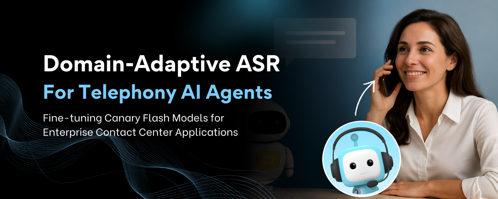

# BOTNOI ASR Telephony Benchmark

[](http://arxiv.org/abs/2608.24916)
[](https://huggingface.co/datasets/Botnoi/voicebot-telephony-speech)

Domain-adaptive ASR benchmark and reference fine-tuning recipes for enterprise contact-center telephony, built on NVIDIA Canary Flash models and the NVIDIA NeMo framework.

This repository accompanies the paper *"Domain-Adaptive ASR for Telephony AI Agents: Fine-tuning Canary Flash Models for Enterprise Contact Center Applications"* (Boonpramuk, Voravuthikunchai & Bunyang, Botnoi Group, 2026) — available on arXiv at [arxiv.org/abs/2608.24916](http://arxiv.org/abs/2608.24916).

The telephony track's benchmark test set is publicly available on Hugging Face at [Botnoi/voicebot-telephony-speech](https://huggingface.co/datasets/Botnoi/voicebot-telephony-speech).

## What is here

- **Benchmark definition** — evaluation protocol, test splits, and metrics (CER, RTFx) for Thai telephony ASR, business-critical jargon (names and addresses), and latency.
- **Leaderboard** — public results table and submission instructions under [`benchmarks/`](benchmarks/).
- **Data card** — how the BOTNOI telephony dataset was collected, its scope and limitations, and how to access it on Hugging Face. See [`data/README.md`](data/README.md).
- **Evaluation scripts** — reference CER/RTFx scoring compatible with NeMo manifests and Hugging Face datasets, under [`evaluation/`](evaluation/).
- **Contribution site** — a small GitHub Pages site (under [`docs/`](docs/)) where external contributors can read the protocol and reach the maintainers.

## Quick start

```bash
git clone https://github.com/OHM-Songpol/Botnoi_ASR_telephony.git
cd Botnoi_ASR_telephony
pip install -r evaluation/requirements.txt

python evaluation/compute_cer.py \
    --manifest path/to/your_predictions.jsonl \
    --references data/botnoi_telephony_test.jsonl
```

Each line of the predictions file should be JSON with `audio_filepath`, `text` (prediction), and optionally `duration`. Reference manifests and audio can be downloaded from the [Hugging Face dataset](https://huggingface.co/datasets/Botnoi/voicebot-telephony-speech).

## Headline results (from the paper)

| Track                                    | Metric | Whisper-large-v3 | BOTNOI Canary 180M Flash |
|------------------------------------------|--------|-------------------|---------------------------|
| Thai — Common Voice 23                   | CER    | 7.25              | **4.66**                  |
| Telephony — BOTNOI telephony test        | CER    | 48.44             | **9.04**                  |
| Names and addresses — BOTNOI jargon test | CER    | 22.99             | **3.78**                  |
| Latency — single A100, batch 32          | RTFx   | 56.5              | **601.8**                 |

Whisper-large-v3 is shown as a consistent reference point across all four tracks. The paper also evaluates against ElevenLabs Scribe v2 and Google Chirp 3, which are the strongest off-the-shelf baselines on some tracks (e.g. Google Chirp 3 reaches 13.42% CER on telephony and 9.86% on names/addresses) — see the [full leaderboard](benchmarks/leaderboard.md) for the complete comparison.

## Citation

If you use this benchmark or the associated models, please cite:

```bibtex
@techreport{boonpramuk2026botnoi,
  title  = {Domain-Adaptive ASR for Telephony AI Agents:
            Fine-tuning Canary Flash Models for Enterprise Contact Center Applications},
  author = {Boonpramuk, Chanameth and Voravuthikunchai, Winn and Bunyang, Songpol},
  year   = {2026},
  institution = {Botnoi Group},
  eprint = {2608.24916},
  archivePrefix = {arXiv},
  url    = {http://arxiv.org/abs/2608.24916}
}
```

See also [`CITATION.cff`](CITATION.cff).

## Contributing

We welcome contributions of new baselines, additional telephony domains, and improvements to the evaluation harness. Please read [`CONTRIBUTING.md`](CONTRIBUTING.md) before opening an issue or a pull request.

## Contact

- **Chanameth Boonpramuk** — chanameth.b@botnoigroup.com
- **Winn Voravuthikunchai** — winnv@botnoigroup.com
- **Songpol Bunyang** — songpol.b@botnoigroup.com
- Website: https://OHM-Songpol.github.io/Botnoi_ASR_telephony/
- Paper: http://arxiv.org/abs/2608.24916
- Dataset: https://huggingface.co/datasets/Botnoi/voicebot-telephony-speech

## License

- **Code** in this repository is released under the Apache License 2.0 (see [`LICENSE`](LICENSE)).
- **Data** is released under separate terms described in [`data/README.md`](data/README.md).
